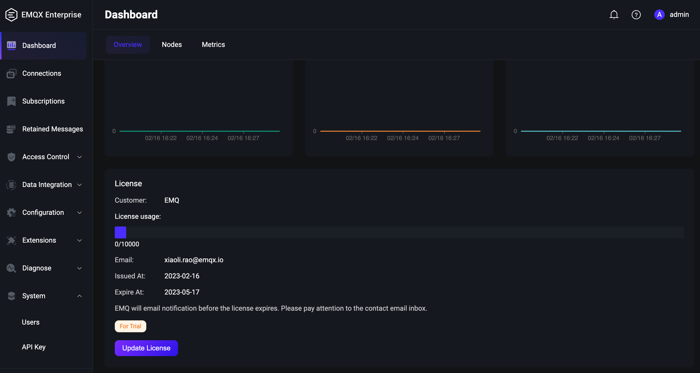
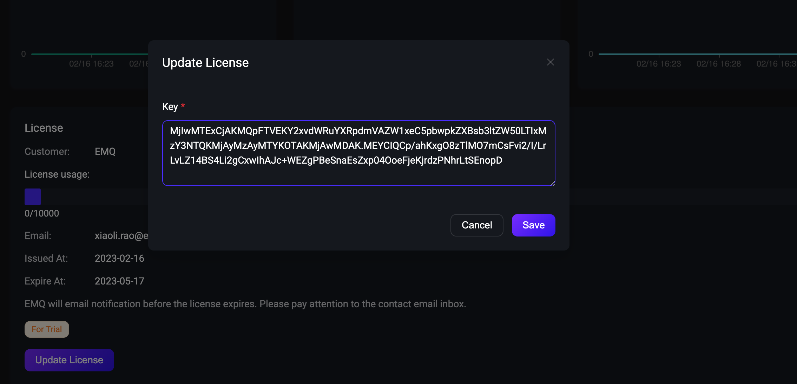

# Configure EMQX Enterprise Edition License

## Task target
 
- How to configure EMQX Enterprise Edition License.
- How to update the EMQX Enterprise Edition License.

## Configure EMQX Enterprise Edition License

EMQX Enterprise Edition License can be applied for free on EMQ official website: [Apply for EMQX Enterprise Edition License](https://www.emqx.com/en/apply-licenses/emqx).

:::: tabs type:card
::: tab v2alpha1

- Configure EMQX cluster

The corresponding CRD of EMQX Enterprise Edition in EMQX Operator is EMQX. EMQX CRD supports using `.spec.bootstrapConfig` to configure EMQX cluster license. For bootstrapConfig configuration, please refer to the document: [bootstrapConfig](https://www.emqx.io/docs/en/v5.0/admin/cfg.html). This field is only allowed to be configured when creating an EMQX cluster, and does not support updating. **Note:** After creating an EMQX cluster, if you need to update the license, please update it through the EMQX Dashboard.

```yaml
apiVersion: apps.emqx.io/v2alpha1
kind: EMQX
metadata:
   name: emqx-ee
spec:
   bootstrapConfig: |
     license {
       key = "..."
     }
   image: emqx/emqx-enterprise:5.0.0
   dashboardServiceTemplate:
     metadata:
       name: emqx-dashboard
     spec:
       type: NodePort
       selector:
         apps.emqx.io/db-role: core
       ports:
         - name: "dashboard-listeners-http-bind"
           protocol: TCP
           port: 18083
           targetPort: 18083
           nodePort: 32012
```

**NOTE**: `license.key` in the `bootstrapConfig` field indicates the content of the license. In this example, the content of the license is omitted, please fill it in by the user.

:::
::: tab v1beta4

- Create Secret based on License file

A Secret is an object that contains a small amount of sensitive information such as a password, token, or key. For more detailed documentation on Secret, please refer to: [Secret](https://kubernetes.io/docs/concepts/configuration/secret/). EMQX Operator supports using Secret to mount License information, so we need to create a Secret based on the License before creating an EMQX cluster.

```
kubectl create secret generic test --from-file=emqx.lic=/path/to/license/file
```

**NOTE**: `/path/to/license/file` indicates the path of the EMQX Enterprise Edition License file, which can be an absolute path or a relative path. For more details on using kubectl to create a Secret, please refer to the document: [Using kubectl to create a secret](https://kubernetes.io/docs/tasks/configmap-secret/managing-secret-using-kubectl/).

The output is similar to:

```
secret/test created
```

- Configure EMQX cluster

The corresponding CRD of EMQX Enterprise Edition in EMQX Operator is EmqxEnterprise. EmqxEnterprise supports configuring EMQX Enterprise Edition License through `.spec.license.secretName` field. For the specific description of the secretName field, please refer to: [secretName](https://github.com/emqx/emqx-operator/blob/main-2.1/docs/en_US/reference/v1beta4-reference.md#emqxlicense).

```yaml
apiVersion: apps.emqx.io/v1beta4
kind: EmqxEnterprise
metadata:
  name: emqx-ee
spec:
  license:
    secretName: test
  template:
    spec:
      emqxContainer:
        image:
          repository: emqx/emqx-ee
          version: 4.4.14
```

**NOTE**: `secretName` indicates the name of the Secret created in the previous step.

:::
::: tab v1beta3

- Create Secret based on License file

A Secret is an object that contains a small amount of sensitive information such as a password, token, or key. For more detailed documentation on Secret, please refer to: [Secret](https://kubernetes.i/docs/concepts/configuration/secret/). EMQX Operator supports using Secret to mount License information, so we need to create a Secret based on the License before creating an EMQX cluster.

```
kubectl create secret generic test --from-file=emqx.lic=/path/to/license/file
```

**NOTE**: `/path/to/license/file` indicates the path of the EMQX Enterprise Edition License file, which can be an absolute path or a relative path. For more details on using kubectl to create a Secret, please refer to the document: [Using kubectl to create a secret](https://kubernetes.io/docs/tasks/configmap-secret/managing-secret-using-kubectl/).

The output is similar to:

```
secret/test created
```

- Configure EMQX cluster

The corresponding CRD of EMQX Enterprise Edition in EMQX Operator is EmqxEnterprise. EmqxEnterprise supports configuring the EMQX Enterprise Edition License through `.spec.emqxTemplate.license.secretName` field. For the specific description of the secretName field, please refer to: [secretName](https://github.com/emqx/emqx-operator/blob/2.0.2/docs/en_US/reference/v1beta3-reference.md#license).

```yaml
apiVersion: apps.emqx.io/v1beta3
kind: EmqxEnterprise
metadata:
   name: emqx-ee
spec:
   emqxTemplate:
     image: emqx/emqx-ee:4.4.14
     license:
       secretName: test
```
**NOTE**: `secretName` indicates the name of the Secret created in the previous step.

:::
::::

Save the above content as: emqx-license.yaml, and execute the following command to deploy the EMQX Enterprise Edition cluster.

```
kubectl apply -f emqx-license.yaml
```

The output is similar to:

```
emqx.apps.emqx.io/emqx-ee created
```

- Check whether the EMQX Enterprise Edition cluster is ready

:::: tabs type:card
::: tab v2alpha1

```bash
kubectl get emqx emqx-ee -o json | jq ".status.emqxNodes"
```

The output is similar to:

```
[
   {
     "node": "emqx@emqx-ee-core-0.emqx-ee-headless.default.svc.cluster.local",
     "node_status": "running",
     "otp_release": "24.3.4.2-1/12.3.2.2",
     "role": "core",
     "version": "5.0.0"
   },
   {
     "node": "emqx@emqx-ee-core-1.emqx-ee-headless.default.svc.cluster.local",
     "node_status": "running",
     "otp_release": "24.3.4.2-1/12.3.2.2",
     "role": "core",
     "version": "5.0.0"
   },
   {
     "node": "emqx@emqx-ee-core-2.emqx-ee-headless.default.svc.cluster.local",
     "node_status": "running",
     "otp_release": "24.3.4.2-1/12.3.2.2",
     "role": "core",
     "version": "5.0.0"
   }
]
```

**NOTE:** node represents the unique identifier of the EMQX node in the cluster. node_status indicates the status of EMQX nodes. otp_release indicates the version of Erlang used by EMQX. role represents the EMQX node role type. version indicates the EMQX version. EMQX Operator creates an EMQX cluster with three core nodes and three replicant nodes by default, so when the cluster is running normally, you can see information about three running core nodes and three replicant nodes. If you configure the `.spec.coreTemplate.spec.replicas` field, when the cluster is running normally, the number of running core nodes displayed in the output should be equal to the value of this replicas. If you configure the `.spec.replicantTemplate.spec.replicas` field, when the cluster is running normally, the number of running replicant nodes displayed in the output should be equal to the replicas value.

:::
::: tab v1beta4

```bash
kubectl get emqxenterprise emqx-ee -o json | jq ".status.emqxNodes"
```
The output is similar to:

```
[
   {
     "node": "emqx-ee@emqx-ee-0.emqx-ee-headless.default.svc.cluster.local",
     "node_status": "Running",
     "otp_release": "24.1.5/12.1.5",
     "version": "4.4.14"
   },
   {
     "node": "emqx-ee@emqx-ee-1.emqx-ee-headless.default.svc.cluster.local",
     "node_status": "Running",
     "otp_release": "24.1.5/12.1.5",
     "version": "4.4.14"
   },
   {
     "node": "emqx-ee@emqx-ee-2.emqx-ee-headless.default.svc.cluster.local",
     "node_status": "Running",
     "otp_release": "24.1.5/12.1.5",
     "version": "4.4.14"
   }
]
```

**NOTE:** node represents the unique identifier of the EMQX node in the cluster. node_status indicates the status of EMQX nodes. otp_release indicates the version of Erlang used by EMQX. version indicates the EMQX version. EMQX Operator will pull up the EMQX cluster with three nodes by default, so when the cluster is running normally, you can see the information of the three running nodes. If you configure the `.spec.replicas` field, when the cluster is running normally, the number of running nodes displayed in the output should be equal to the value of replicas.

:::
::: tab v1beta3

```bash
kubectl get emqxenterprise emqx-ee -o json | jq ".status.emqxNodes"
```

The output is similar to:

```
[
   {
     "node": "emqx-ee@emqx-ee-0.emqx-ee-headless.default.svc.cluster.local",
     "node_status": "Running",
     "otp_release": "24.1.5/12.1.5",
     "version": "4.4.14"
   },
   {
     "node": "emqx-ee@emqx-ee-1.emqx-ee-headless.default.svc.cluster.local",
     "node_status": "Running",
     "otp_release": "24.1.5/12.1.5",
     "version": "4.4.14"
   },
   {
     "node": "emqx-ee@emqx-ee-2.emqx-ee-headless.default.svc.cluster.local",
     "node_status": "Running",
     "otp_release": "24.1.5/12.1.5",
     "version": "4.4.14"
   }
]
```

**NOTE:** node represents the unique identifier of the EMQX node in the cluster. node_status indicates the status of EMQX nodes. otp_release indicates the version of Erlang used by EMQX. version indicates the EMQX version. EMQX Operator will pull up the EMQX cluster with three nodes by default, so when the cluster is running normally, you can see the information of the three running nodes. If you configure the `.spec.replicas` field, when the cluster is running normally, the number of running nodes displayed in the output should be equal to the value of replicas.

:::
::::

- Check the EMQX Enterprise Edition License information

```
kubectl exec -it emqx-ee-core-0 -c emqx -- emqx_ctl license info
```

The output is similar to:

```
customer        : EMQ
email           : cloudnative@emqx.io
deployment      : deployment-6159820
max_connections : 10000
start_at        : 2023-02-16
expiry_at       : 2023-05-17
type            : trial
customer_type   : 0
expiry          : false

```

**NOTE**: From the output results, you can see the basic information of the license we applied for, including applicant information, the maximum number of connections supported by the license, and the expiration time of the license.

## Update EMQX Enterprise Edition License

:::: tabs type:card
::: tab v2alpha1

- Update License through EMQX Dashboard

Open the browser, enter the host `IP` and port `32012` where the EMQX Pod is located, log in to the EMQX cluster Dashboard (Dashboard default user name: admin, default password: public), enter the Dashboard click Overview and pull down the page to the bottom to see The current license information of the cluster, as shown in the following figure:



Then click the Update License button to upload the latest License Key content, as shown in the following figure:



Finally, click the Save button to save the update. The following picture shows the updated License information:


As can be seen from the above figure, the content of the license has been updated, which means that the license has been updated successfully.

:::
::: tab v1beta4

- Update EMQX Enterprise Edition License Secret

```
kubectl create secret generic test --from-file=emqx.lic=/path/to/license/file --dry-run -o yaml | kubectl apply -f -
```

The output is similar to:

```
secret/test configured
```

- Check whether the EMQX cluster license has been updated

```
kubectl exec -it emqx-ee-0 -c emqx -- emqx_ctl license info
```

The output is similar to:

```
customer                 : cloudnative
email                    : cloudnative@emqx.io
max_connections          : 100000
original_max_connections : 100000
issued_at                : 2022-11-21 02:49:35
expiry_at                : 2022-12-01 02:49:35
vendor                   : EMQ Technologies Co., Ltd.
version                  : 4.4.14
type                     : official
customer_type            : 2
expiry                   : false
```

**NOTE**: If the certificate information is not updated, you can wait for a while, the update of the license will be delayed. From the above output results, we can see that the content of the License has been updated, which means that the EMQX Enterprise Edition License has been updated successfully.

:::
::: tab v1beta3

- Update EMQX Enterprise Edition License Secret

```
kubectl create secret generic test --from-file=emqx.lic=/path/to/license/file --dry-run -o yaml | kubectl apply -f -
```

The output is similar to:

```
secret/test configured
```

- Check whether the EMQX cluster license has been updated

```
kubectl exec -it emqx-ee-0 -c emqx -- emqx_ctl license info
```

The output is similar to:

```
customer                 : cloudnative
email                    : cloudnative@emqx.io
max_connections          : 100000
original_max_connections : 100000
issued_at                : 2022-11-21 02:49:35
expiry_at                : 2022-12-01 02:49:35
vendor                   : EMQ Technologies Co., Ltd.
version                  : 4.4.14
type                     : official
customer_type            : 2
expiry                   : false
```

**NOTE**: If the certificate information is not updated, you can wait for a while, the update of the license will be delayed. From the above output results, we can see that the content of the License has been updated, which means that the EMQX Enterprise Edition License has been updated successfully.

:::
::::